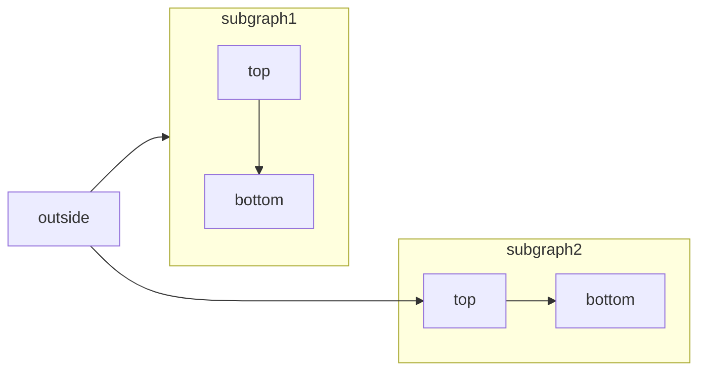

import SnippetIntro from '/snippets/snippet-intro.mdx';

# Development Paged

<Info>
  **Prerequisite**: Please install Node.js (version 19 or higher) before proceeding. \
  Please upgrade to `docs.json` before proceeding and delete the legacy `mint.json` file.
</Info>

Follow these steps to install and run Mintlify on your <Tooltip tip="Add tooltip text" headline="saas" cta="sanoke text">operating</Tooltip> system:

<ResponseExample>

```text filename
wesh
```

</ResponseExample>



<Badge shape="pill">Label/</Badge>

/

# Hey

## Hey

## hey

#### Hey

/

|  |  |  |  |
| --- | --- | --- | --- |
|  |  |  |  |
|  |  |  |  |

**Step 1**: Install Mintlify:

<Update label="04/16/2026">
  ## This is aother one

  this is an xample
</Update>

/code

<CodeGroup>

```bash npm
npm i -g mintlify
```

```bash yarn
yarn global add mintlify
```

</CodeGroup>

**Step 2**: Navigate to the docs directory (where the `docs.json` file is located) and execute the following command:

```bash
mintlify dev
```

A local preview of your documentation will be available at `http://localhost:3000`.<Badge>H</Badge>

### Custom Ports

By default, Mintlify uses port 3000. You can customize the port Mintlify runs on by using the `--port` flag. To run Mintlify on port 3333, for instance, use this command:

```bash
mintlify dev --port 3333
```

If you attempt to run Mintlify on a port that's already in use, it will use the next available port:

```md
Port 3000 is already in use. Trying 3001 instead.
```

## Mintlify Versions

Please note that each CLI release is associated with a specific version of Mintlify. If your local website doesn't align with the production version, please update the CLI:

<CodeGroup>

```bash npm
npm i -g mintlify@latest
```

```bash yarn
yarn global upgrade mintlify
```

</CodeGroup>

## Validating Links

The CLI can assist with validating reference links made in your documentation. To identify any broken links, use the following command:

```bash
mintlify broken-links
```

## Deployment

<Check>
  Unlimited editors available under the [Pro Plan](https://mintlify.com/pricing) and above.
</Check>

If the deployment is successful, you should see the following:

<Frame>
  
</Frame>

## Code Formatting

We suggest using extensions on your IDE to recognize and format MDX. If you're a VSCode user, consider the [MDX VSCode extension](https://marketplace.visualstudio.com/items?itemName=unifiedjs.vscode-mdx) for syntax highlighting, and [Prettier](https://marketplace.visualstudio.com/items?itemName=esbenp.prettier-vscode) for code formatting.

## Troubleshooting

<AccordionGroup>
  <Accordion title='Error: Could not load the "sharp" module using the darwin-arm64 runtime'>
    This may be due to an outdated version of node. Try the following:

    1. Remove the currently-installed version of mintlify: `npm remove -g mintlify`
    2. Upgrade to Node v19 or higher.
    3. Reinstall mintlify: `npm install -g mintlify`
  </Accordion>

  <Accordion title="Issue: Encountering an unknown error">
    Solution: Go to the root of your device and delete the ~/.mintlify folder. Afterwards, run `mintlify dev` again.
  </Accordion>
</AccordionGroup>

Curious about what changed in the CLI version? [Check out the CLI changelog.](https://www.npmjs.com/package/mintlify?activeTab=versions)

### This is h3

#### This is cool

$E = mc^2$ ba